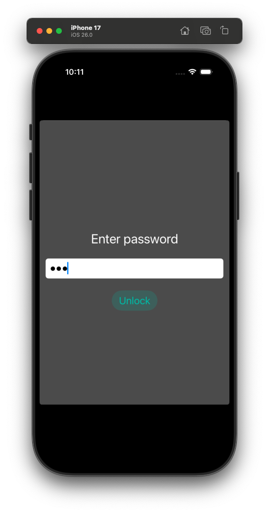
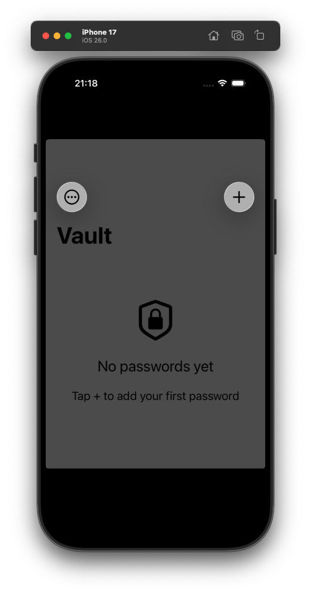
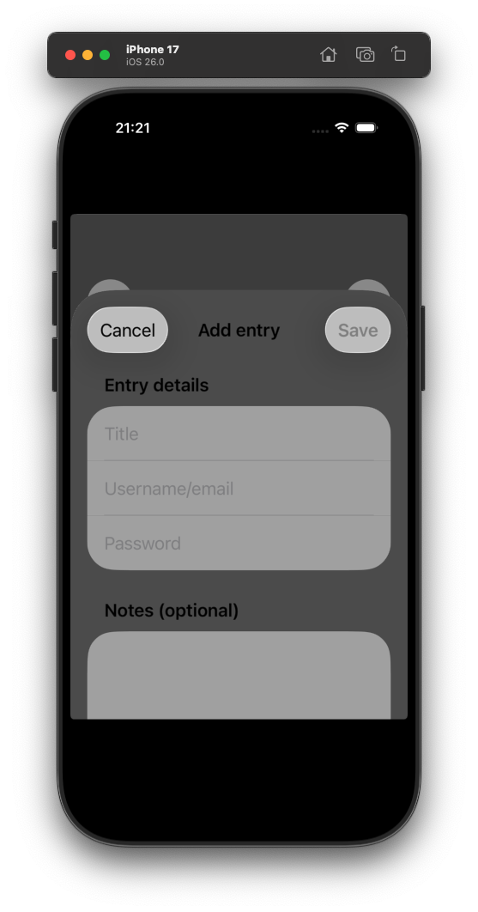
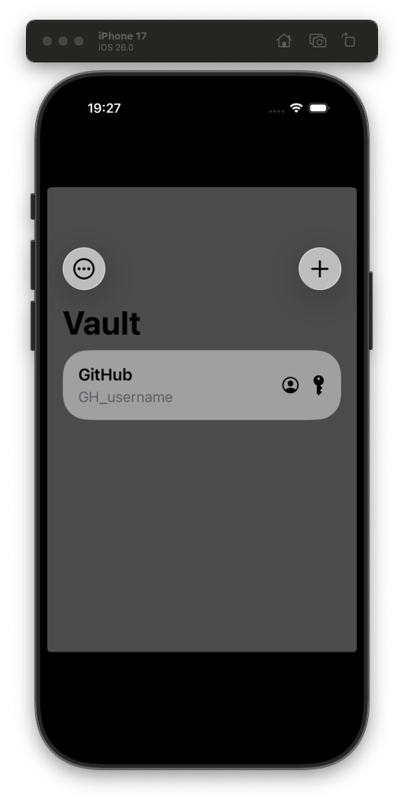
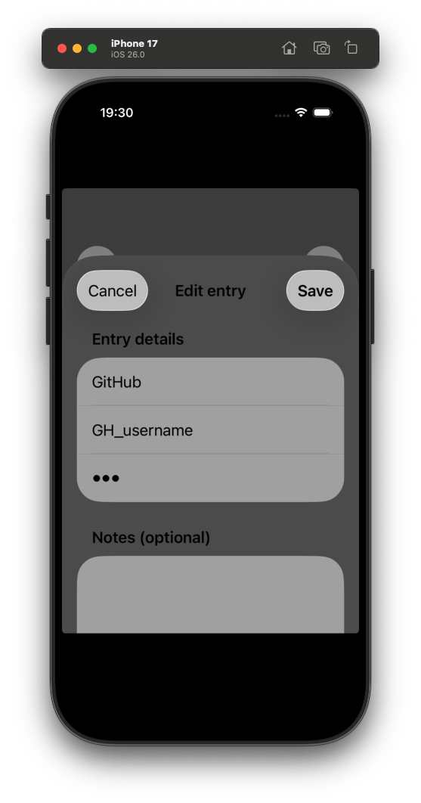
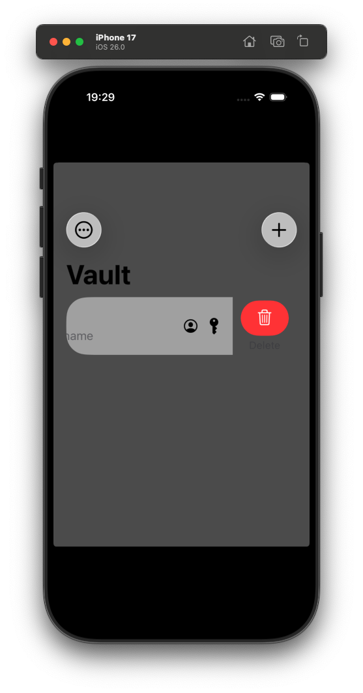

# password-vault

Simple iOS and macOS password vault with components in both Swift and Objective-C to gain a better understanding of both languages.

## Features

- Apple Keychain integration for managing the vault password (Swift)
- Basic vault password validation (Objective-C)
- Add/update/delete password functionality for stored password management (Objective-C)
- File encryption: the vault storage is encrypted at rest (Swift)

## Requirements

- iOS 26.0+
- macOS 15.6+
- Xcode 26.0.1+

## Preview

<p align="center">
  
  
  
  
  
  
</p>

## Command cheatsheet

### Build

```
$ xcodebuild build -scheme password-vault -derivedDataPath build -destination 'platform=iOS Simulator,arch=arm64,name=iPhone 17' -quiet
```

### Run

```
$ xcrun simctl boot "iPhone 17"
$ open -a Simulator
$ xcrun simctl install "iPhone 17" build/Build/Products/Debug-iphonesimulator/password-vault.app
$ xcrun simctl launch "iPhone 17" gemesa.password-vault
```

### Terminate

```
$ xcrun simctl terminate "iPhone 17" gemesa.password-vault
```

### Format Swift

```
$ brew install swift-format
$ swift-format -i -r password-vault/
```

Alternatively, use `Editor` --> `Structure` --> `Format File with 'swift-format'` or `Ctrl + Shift + I`.

### Lint Swift

```
$ brew install swiftlint
$ swiftlint --strict password-vault/
```

### Format Objective-C

```
$ find password-vault/ -name "*.m" -o -name "*.h" | xargs clang-format -i
```

Alternatively, use `Editor` --> `Structure` --> `Format File with 'clang-format'` or `Ctrl + Shift + I`.

### Analyze Objective-C

```
$ xcodebuild analyze -scheme password-vault -destination 'platform=iOS Simulator,name=iPhone 17' -quiet GCC_TREAT_WARNINGS_AS_ERRORS=YES
```
